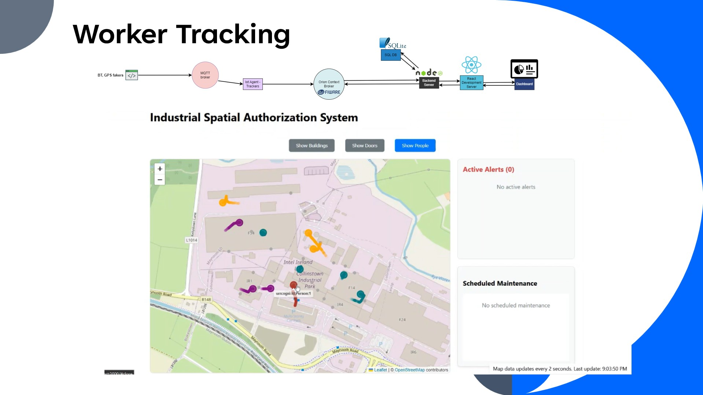
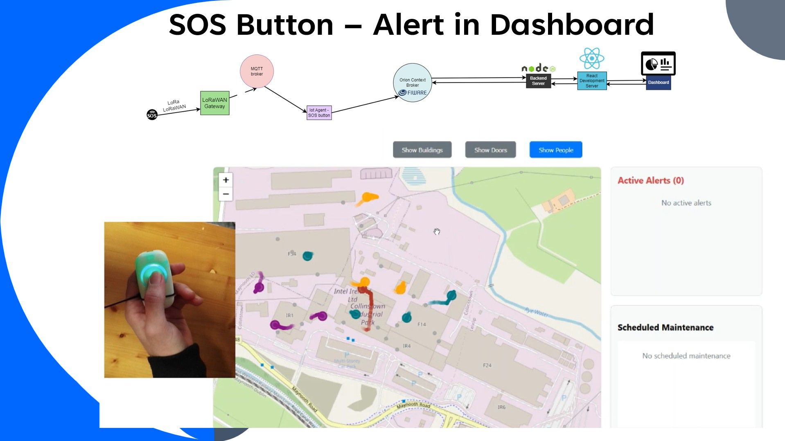
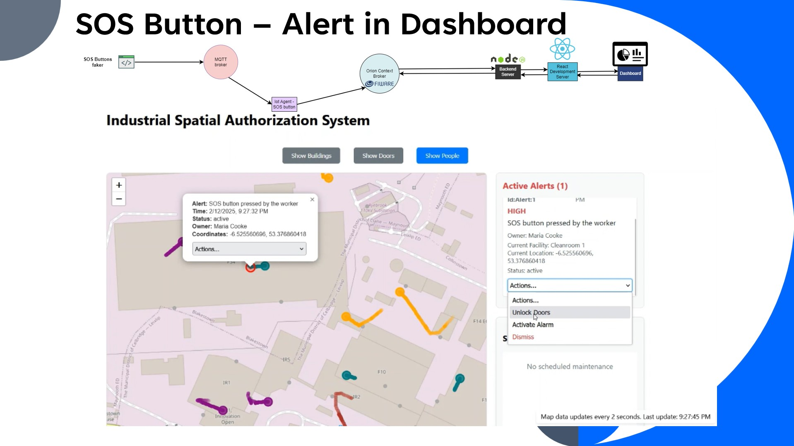
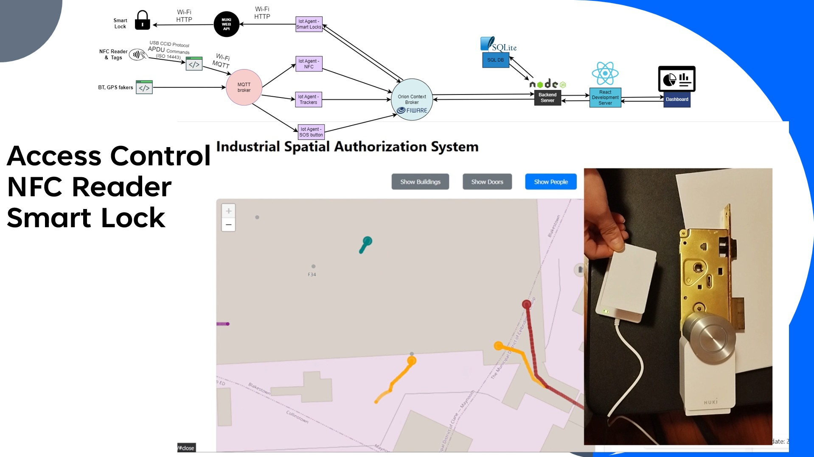
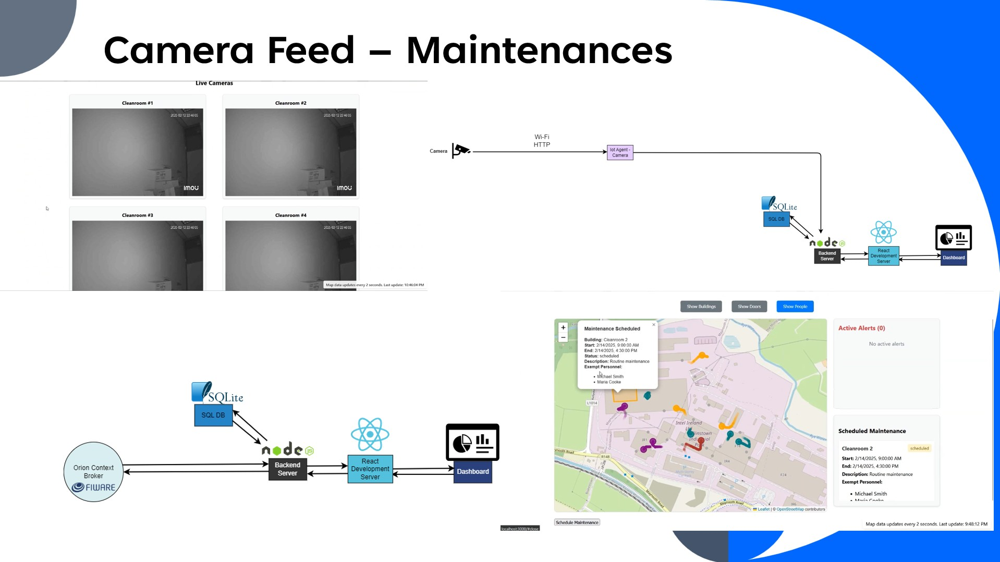
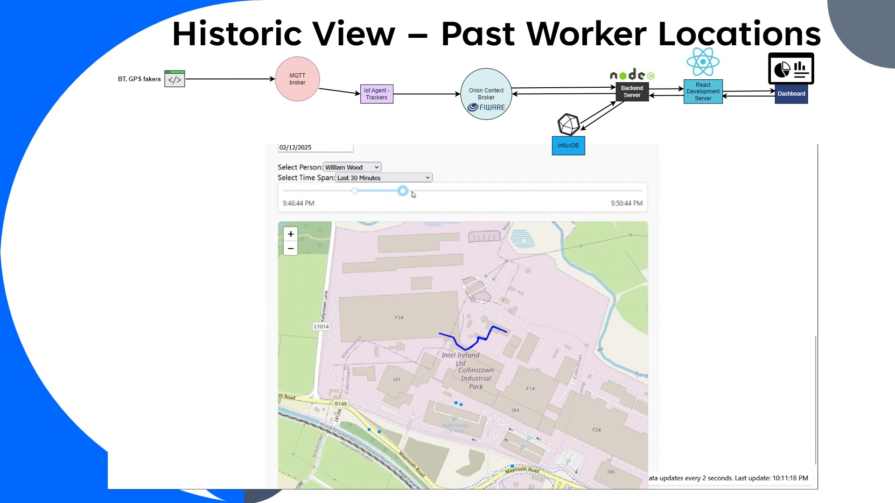
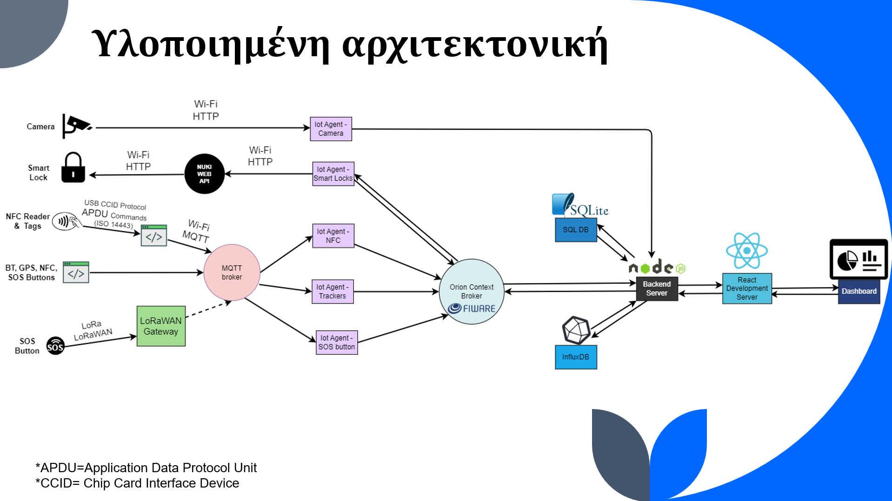

# IoT-ISAS
---

## Architecture
---

## Run worker routes simulation
---
- Go to IoT-devices
- Run beacon_mimic.py
- Simultaneously, run in a new terminal IoTAgent-Trackers.py
- Have the server up and running
- Visit the app

## Run SOS button being pressed simulation
---
- Have the server up and running
- Go to IoT-devices
- Run IoTAgent-SOSButtons.py
- In a new terminal, run button_mimic.py
- Press Enter in the button_mimic.py to send a SOS button message
- Visit the app

## HOW TO START:

---
- Go to `./source.`
- Execute `npm install`
- Execute `npm run install-start:all`

_Alternatively:_
---

### Start node server on localhost:3001
- Go to `./source/`
- Execute `npm install` to have all the pertinent node modules
- Execute `npm start` to have the node server up and running

### Start React development server on localhost:3000

- Go to `./source/frontend/`
- Execute `npm install` to have all the pertinent node modules
- Execute `npm start` for the React app to start through the development server.

Visit http://localhost:3000

